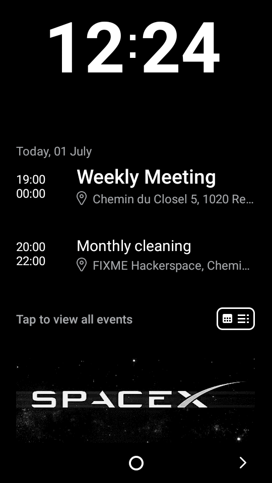
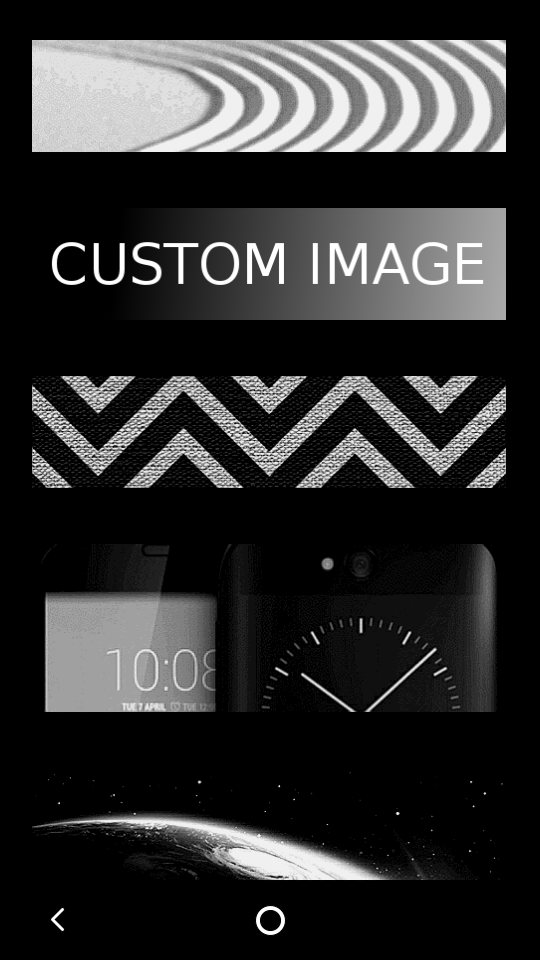
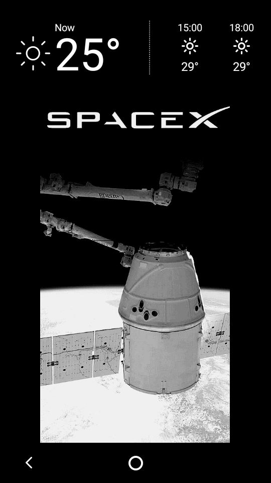
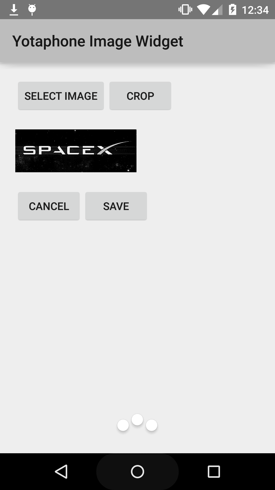

Yota Image Widget
=================

* Widget for the [YotaPhone 2](http://yotaphone.com/us-en/) e-ink back screen
* Displays a simple image in small/medium/large/extra-large sizes as a widget
* Play store: https://play.google.com/store/apps/details?id=info.lamatricexiste.yotaimage

Build from the command line
---------------------------

* Install gradle >= 1.10: https://gradle.org/downloads/
* Install Android SDK in /opt/android-sdk (or modify local.properties to match your install): https://developer.android.com/sdk/installing/index.html?pkg=tools
* [Optionnal] Install YotaPhone SDK: http://yotaphone.com/developer/docs/tools/download-and-install-yotaphone-sdk/
* Be sure to have Android API level 22 and Android SDK Build-tools 21.1.2 installed
* run gradle
```
  gradle assembleDebug #to create debug apk
  gradle installDebug #install debug apk to device/emulator
```
* APK will be in ./app/build/outputs/apk/app-debug.apk
* To build the release version
```
  export ANDROID_KEYSTORE="/home/$USER/.android/my-release-key.keystore"
  export ANDROID_KEYALIAS="your_keystore_name"
  gradle assembleRelease
```

Build with Android studio
-------------------------

* Download and install Android studio: https://developer.android.com/sdk/index.html
* Import the project and enjoy!

Screenshots
----------





